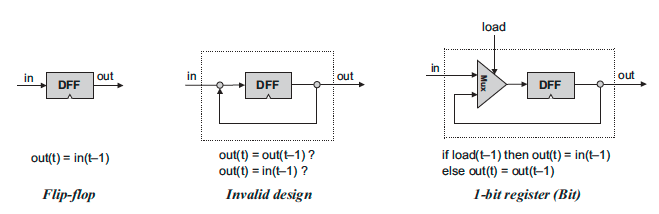
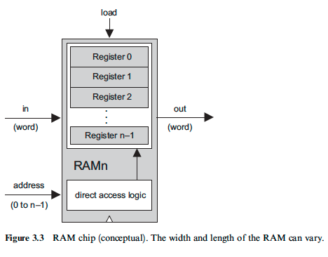

## The Elements of Computing Systems
컴퓨터 구조에 대한 이해가 필요하다는 생각에 책을 샀지만, 이전에 3장의 벽에 부딪혀 한번 중단했었다.
책 자체는 정말 좋은 내용이고, 심지어 책의 구조가 모든 내용을 스스로 구현하는 과제 형태로 되어 있어서(테스트 케이스, 스크립트, 툴까지 제공한다) 한번 훑고 이해했다 착각하고 넘어갈 수가 없다.
현업에서 직접 써먹을 일은 거의 없겠지만, 항상 완벽하게 이해하고 싶었던 내용이라서 언젠가는 반드시 모든 과정을 수행하리라 다짐했었다.  

책에서 다루는 내용은 아래와 같다.
1. 불 논리
2. 불 연산
3. 순차 논리
4. 기계어
5. 컴퓨터 아키텍처
6. 어셈블러
7. 가상 머신 I: 스택 산술
8. 가상 머신 II: 프로그램 제어
9. 고수준 언어
10. 컴파일러 I: 구문 분석
11. 컴파일러 II: 코드 생성
12. 운영체제

## 01. 불 논리
하드웨어 중에서도 가장 기초적인 칩을 소프트웨어로 구현해본다.  
가장 기초가 되는 NAND 게이트를 활용하여, AND, OR, NOT 등의 기초적인 게이트를 구현해보고, MUX, DMUX 등의 컴포넌트를 구현해보는 과정이다. 구현을 마치면 Hardware Simulator라는 툴을 통해 작성한 로직이 실제로 의도한 대로 동작하는지 테스트해볼 수 있다.

실제로 사용되는 하드웨어에서의 구현과는 차이가 크지만, 추후 더 큰 시스템을 구성해나가는 데 있어 가장 기초가 되는 컴포넌트를 실제로 만들어본다는 점에서 의미가 있고, 간단한 HDL(Hardware Description Language)과 Hardware Simulator 사용법을 이해하게 되었다.

## 02. 불 연산
거의 모든 연산의 기본이 되는 덧셈을 수행하는 회로(칩)을 1장에서 구현한 간단한 회로를 사용하여 반가산기(HalfAdder), 전가산기(FullAdder)를 거쳐 실제로 구현해보고, 다시 이를 활용하여 ALU(Arithmetic Logic Unit)를 만들면서 컴퓨터가 어떻게 비트를 사용하여 연산을 수행하는지를 배운다. 1장에서 구현한 MUX, DMUX같은 컴포넌트를 대체 어디에 써먹는건지 이해할 수 있게 되었다.

## 03. 순차 논리
첫 번째 고비였다(두 번째 고비가 언제일지는 모른다). 
그 동안 구현한 논리들은 입력값에 따라 출력값이 결정되었지만(조합 논리), 데이터를 저장하는 논리의 구현을 위해서는 입력 신호 뿐만 아니라 시간의 흐름에 따라 출력이 결정되는 논리(순차 논리)가 필요하다. 물론 시간의 흐름이라는 것도 결국 주기적으로 발생하는 입력 신호로 구현되지만, 그것을 활용하여 실제로 논리를 구현하는 데에는 꽤 오랜 시간이 걸렸다. 

컴퓨터는 마스터 클락이라는 장치에서 `tick`과 `tock`이라는 신호를 끊임없이 전달하면서 시간의 흐름을 시뮬레이션하며, 시스템 내부의 순차 논리를 수행하는 모든 회로는 이를 전달받아 `tick` 신호에 입력값을 업데이트하고 `tock` 신호에 이에 기반한 출력값을 출력한다.

순차 논리의 핵심이 되는 회로는 DFF(Data Flip-Flop)으로, 입력값을 단위시간만큼의 지연을 거친 뒤 출력하는 논리를 수행한다. 즉, 입력값이 바뀌어도 출력값은 다음 `tock` 신호와 함께 갱신된다.
이 단순한 회로의 출력 핀을 다시 입력 핀에 연결한다는 아이디어가 데이터를 저장하는 논리의 핵심이다. 출력값과 입력값이 무한히 순환하면서, 데이터가 보존되는 것이다.

물론 데이터를 보존하기만 해서는 저장장치의 역할을 수행할 수 없다. 어떤 값을 보존할지 결정할 수 있어야 하는데, '읽기 모드'와 '쓰기 모드'라는 상태를 부여함으로서 이를 해결하고 1개의 비트를 저장하는 간단한 로직을 구성할 수 있다.

- 읽기 모드: 입력값과 상관없이 이전 사이클의 출력값을 다시 출력
- 쓰기 모드: 다음 사이클에 현재 입력되는 값을 출력

이를 확장하여 원하는 크기의 데이터를 저장할 수 있도록 구성한 것을 레지스터(Register)라고 부르며, 레지스터의 크기는 해당 시스템이 다루는 데이터 크기의 기본 단위가 되어 이를 워드(word) 크기라고 부른다.

레지스터를 확장하면 비로소 RAM(Random Access Memory)이 되는데, 말 그대로 Random Access가 가능한 메모리라는 의미이다.

- '메모리': 메모리 기능은 결국 수많은 레지스터의 집합으로 구현되며, 따라서 RAM의 크기는 (레지스터의 크기)*(레지스터의 개수)가 된다.
- 'Random Access': 이는 특정 레지스터의 주소 정보를 사용하여 해당 레지스터의 값에 즉시 접근이 가능하다는 의미이다. 메모리 구조를 순차적으로 탐색하는 것보다 빠른 입/출력이 가능하기 때문에 이는 매우 유용하며, DMUX/MUX를 계층적으로 사용하여 이를 구현할 수 있다.

### 출처
- 밑바닥부터 만드는 컴퓨팅 시스템(노암 니산, 시몬 쇼켄 / 인사이트 / 2019)
- https://www.nand2tetris.org/
