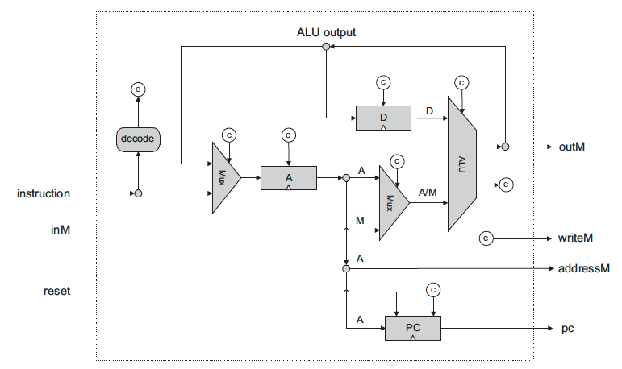

## Computer Architecture
그간 구현했던 모든 회로를 합쳐서 컴퓨터를 완성하는 과정이다.
04장에서 기계어와 어셈블리에 대해 배우고 이를 작성하고 테스트하는 과제를 하면서 01, 02, 03장에서 배운 내용에서 바로 이어지지 않는다는 느낌이 들었는데, 이번 장을 진행하면서 그 빈 부분을 채울 수 있었다.

여태까지의 흐름대로라면 두 장을 하나로 합치거나 04장과 05장의 순서가 바뀌는게 맞지 않나 싶지만, 05장에서 구현하는 회로들이 어떤 방식으로 작동하는지, 또 어떤 역할을 수행하는지를 04장에서 배우지 않았다면 안 그래도 어려운 이번 장에서 더 큰 벽을 느끼기 때문에 순서를 이렇게 구성한 것으로 보인다.

## Project
Memeory, CPU, Computer 3개의 칩을 구현하는 프로젝트가 주어진다.

### Memory
이 칩은 데이터를 읽고 쓰는 저장 장치의 역할을 수행하면서 출력 장치를 주소공간에 mapping하여 추상화하는 역할을 수행한다. 
이렇게 두 개의 역할을 수행함에도 칩의 입/출력 명세는 굉장히 단순한데, 15비트짜리 주소 정보를 입력받은 뒤, 해당 주소에 위치하는 16비트짜리 명령어를 반환하도록 구성하면 된다.
이처럼 단순한 명세를 사용하지만 주소 공간을 분리하여 역할을 다르게 설계함으로서 임의의 데이터 저장 기능과 출력장치 제어 기능을 구현하는 것이 굉장히 인상적이었다.  

입력 주소 정보가 15비트이므로, 해당 칩은 최대 2^15 = 0x8000 ~= 32K(bit)의 정보를 저장할 수 있어야 한다.
하지만 저자는 레지스터를 아래와 같이 사용하도록 구성하였고, 0x6001번 ~ 0x7FFF번 레지스터는 사용하지 않는다.

| Address Area  |      Area Size(dec)     | Area Size(hex)    |Description  |
|----------|:-------------:|------:|------:|
| 0x0000 ~ 0x3FFF | 2^14  | 0x4000 | RAM |
| 0x4000 ~ 0x5FFF |    2^13   | 0x2000 |  Screen memory mapping space |
| 0x6000 | 1 | 0x0001 | Keyboard memory mapping space |
| 0x6001 ~ 0x7FFF | 2^13 - 1 | 0x1FFF |  N/A  |

따라서 실제로 필요한 데이터 저장 공간은 레지스터 0x4000 + 0x2000 + 0x0001개로 구성할 수 있다.
이전 챕터에서 구현한 RAM16K(레지스터 0x4000개)와 내장된 Screen(레지스터 0x2000개, 이전에 구성한 RAM8K(16bit)와 같은 역할을 하지만, 테스트 시 스크린 출력값을 확인할 수 있는 환경이 구성되어 있으므로 대신 사용한다), Keyboard(레지스터 0x0001개, Register와 같은 역할) 3개의 칩을 조합하여 구성한다.

### CPU
CPU는 명령어를 입력받아 이를 수행하는, 컴퓨터에서 가장 핵심이 되는 부품이다. 
02장에서 왜 이런 연산이 필요한지 그 이유는 모르는 채로 과제대로 구현했던 논리들이 04장에서 배운 기본적인 16비트 명령어들에 대응한다는 점을 알게 되었을 때는 감동스럽기까지 했다.
02장에서 구현한 ALU와 03장의 PC(Program Counter), 그리고 04장에서 배운 D와 A, 두 개의 레지스터를 조합하여 구성할 수 있었다.

### Computer
구현한 Memory와 CPU를 사용하여 reset 신호만 받아서 .hack 확장자의 어셈블리 프로그램을 실행할 수 있는 플랫폼이다. 
말이 칩이지 입력이라고는 달랑 1비트짜리 reset 하나에 출력은 아예 없는 것이 드디어 컴퓨터에 가까운 무언가가 등장했다고 느껴졌지만, 이를 구현하는 과정이 굉장히 막막할 뻔했다.
 
다행히 책에서 구조를 다 설계해줘서 그동안 구현한 칩을 책에 나온대로 이어붙이기만 하면 실제로 명령어를 실행할 수 있는 컴퓨터의 구조를 만들어볼 수 있었다.

Computer는 ROM32K라는 Built-in 칩에 존재하는 명령어를 PC가 정해주는 순서대로 수행한다.
ROM32K 칩은 `load` 명령을 사용하여 .hack 파일의 값을 불러오는 기능을 내장한, 읽기 전용의 메모리이다.
만약 reset이 발생하면 ROM을 제외한 모든 레지스터(CPU 레지스터와 RAM, PC)들의 값이 0으로 초기화되면서 Computer의 상태가 초기화된다.

### Debugging
CPU 칩을 테스트하는 중, 제공된 테스트 중 CPU.tst는 통과하였으나 CPU-external.tst는 실패하였다.
뭐가 문제인지 확인해보았으나, 아무리 봐도 테스트 케이스가 잘못된 것으로 보여서 코드가 아니라 케이스를 수정해버리고 넘어갔다.(언제나 그렇듯이, 이렇게 문제를 해결하면 망한다.)

이후 Computer 칩을 완성하고 Add, Max, Rect라는 3개의 테스트 프로그램을 사용한 테스트를 진행하였다.
Add와 Max는 통과하였으나, Rect를 통과하지 못해서 무엇이 문제인지 오랫동안 고민하였다.
Add와 Max에서는 프로그램 이름 그대로의 산술 연산을, Rect에서는 스크린 출력을 테스트하므로, Computer 칩이 출력 장치를 제어하는 로직이 잘못된 것으로 의심하였다.
하지만 Computer는 Memory 칩을 기반으로 동작할 뿐 직접 출력 장치를 제어하는 논리는 가지고 있지 않고, Memory 칩은 이전에 데이터 저장 뿐만 아니라 입/출력 제어 역시 정상적으로 테스트를 통과했다.

디버깅을 위해 .cmp 파일과 .out 파일을 비교한 결과, D 레지스터가 업데이트되지 말아야 하는 상황에서 D 레지스터의 값이 덮어씌워지는 것을 확인할 수 있었다.
즉, 윗 문단의 CPU칩의 구현에서 D 레지스터의 값을 업데이트하는 논리에 오류가 있었는데 그 동안의 테스트에서 한 번도 문제점을 일으키지 않았던 것이다.
관련 오류를 수정하니 내 맘대로 뜯어고쳤던 CPU-external 테스트에 실패하였고, CPU-external.cmp를 초기값으로 수정하니 정상적으로 테스트를 정상적으로 통과하였다. 역시 검증된 테스트 케이스를 마음대로 고치는 건 좋은 결말로 이어질 수가 없는 법이다.
CPU에서 발생한 문제가 해결되니 이를 기반으로 하는 Computer 칩에서도 문제가 해결되어 모든 테스트를 성공적으로 마칠 수 있었다.

### 출처
- 밑바닥부터 만드는 컴퓨팅 시스템(노암 니산, 시몬 쇼켄 / 인사이트 / 2019)
- https://www.nand2tetris.org/
